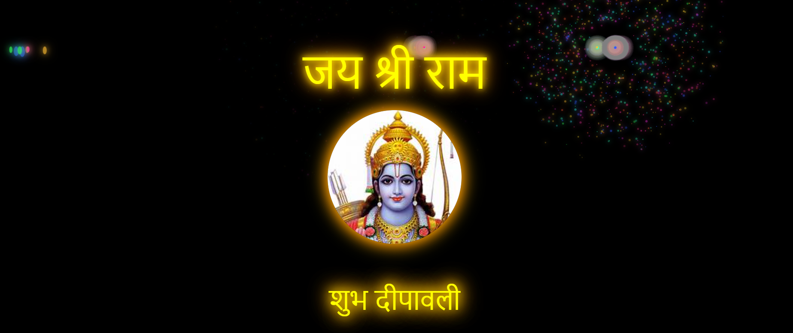

# Fireworks Animation

## Live Demo
Check out the live demo here:  
[Live Demo](https://67938067a6d82ef60feb3c18--spontaneous-hotteok-300297.netlify.app/)

## About
This project is a fun, interactive fireworks animation built using HTML, CSS, and JavaScript. It simulates a vibrant and colorful fireworks display on a black background. The animation includes exploding fireworks particles, rockets, and dynamic text that appears with smooth animations, making it perfect for festive or celebratory occasions. 

The animation also displays an image and a text overlay, making it a great example of how to combine animations, images, and text dynamically in a webpage.

## Features:
- Colorful fireworks with random patterns and sizes
- Exploding particles that move in random directions
- Rockets shooting up with subsequent explosions
- Dynamic text that animates and appears on the screen
- Display of an image with an additional text overlay
- Smooth animation transitions with `requestAnimationFrame` and `CSS` animations

## How It Works:
1. **Fireworks**: Rockets are launched from random positions on the screen, and each rocket explodes into particles. The particles move in random directions and fade out over time.
2. **Text Animation**: The text "जय श्री राम" (meaning "Hail Lord Ram") appears on the screen one letter at a time, followed by an image.
3. **Photo Display**: A photo is shown after the text animation, followed by a text overlay saying "शुभ दीपावली" (meaning "Happy Diwali").

## Technologies Used:
- **HTML5**: To structure the page and display the animation
- **CSS3**: For styling the page and animations (using keyframes for fireworks and text animations)
- **JavaScript**: For generating random firework patterns, controlling animation timing, and updating DOM elements

## Instructions:
1. **Clone/Download**: Clone or download this repository to your local machine.
2. **Open the file**: Open `fireworks-animation.html` in your browser to see the fireworks animation and text display.

## Customization:
- You can adjust the colors and speed of the fireworks by modifying the JavaScript functions `getRandomColor()`, `createFirework()`, and `createRockets()`.
- To change the displayed text, modify the content in the `displayText()` function.
